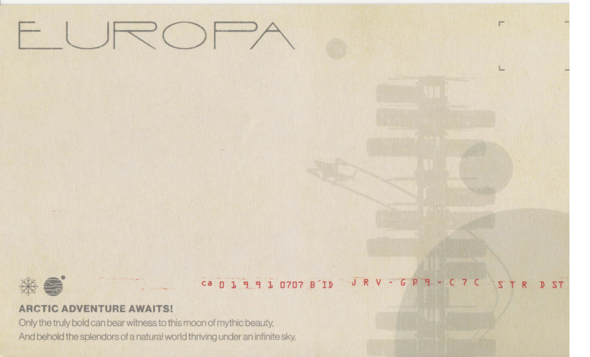
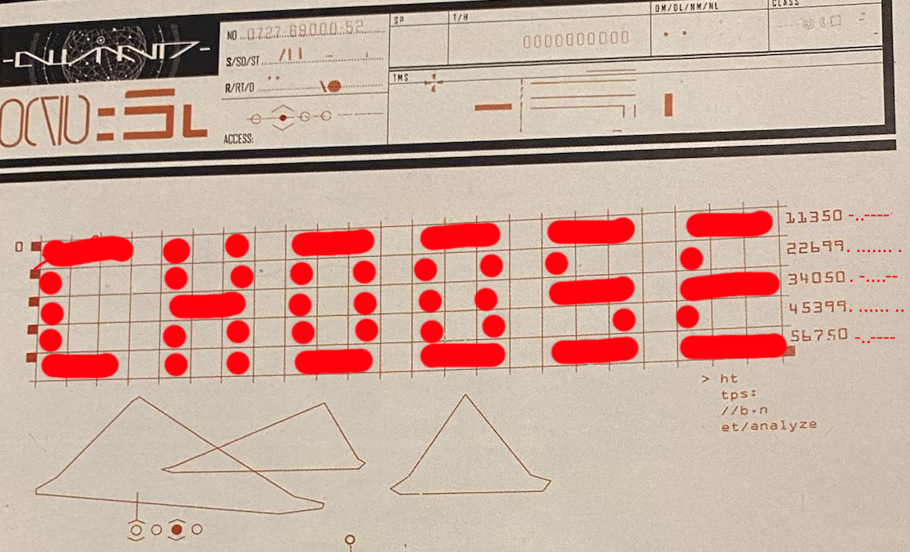
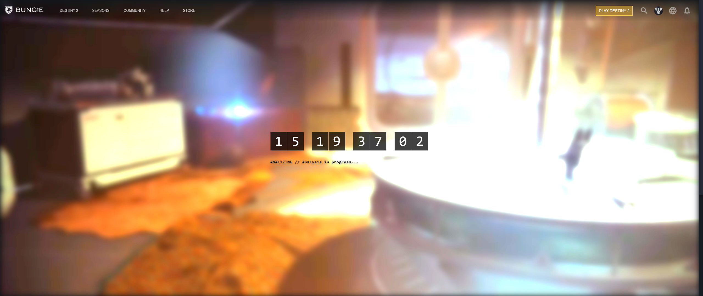
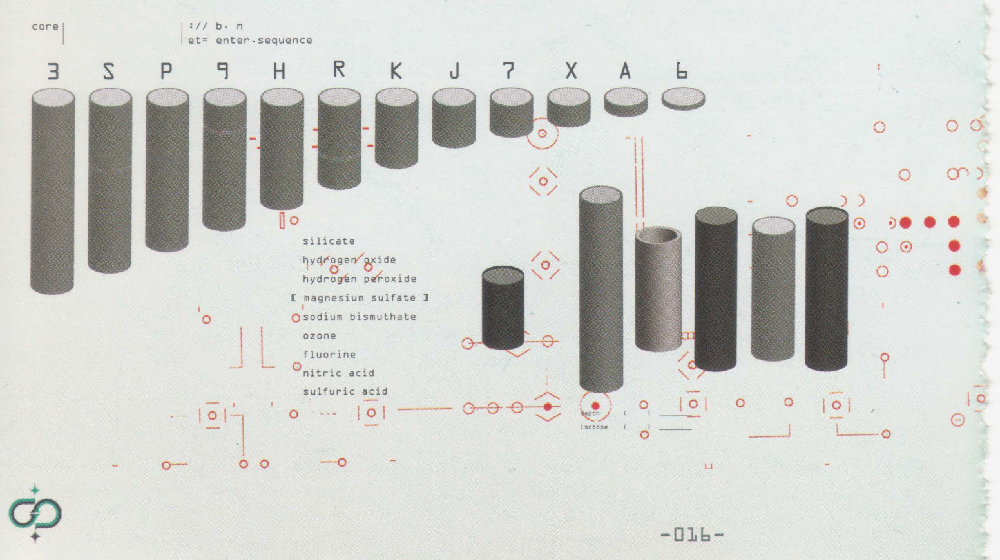
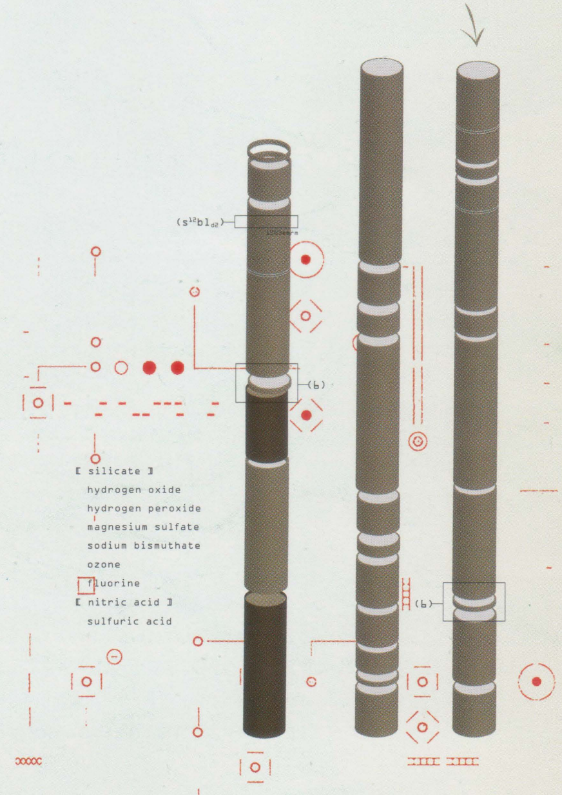
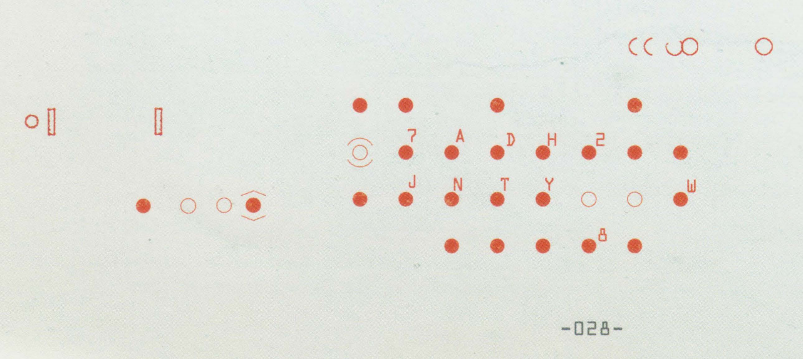
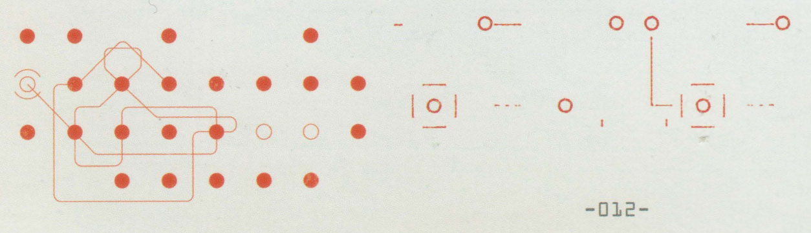
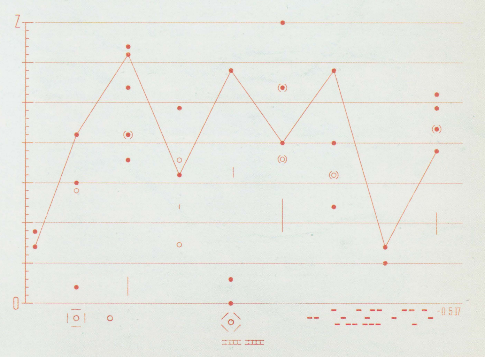

# Destiny 2: Beyond Light ARG
**What we know so far**.

The [Collector's Edition (CE) of Beyond Light](https://eu.bungiestore.com/collections/collectors-edition/products/preorder-destiny-2-beyond-light-collectors-edition-no-game-code) contains the following items: a bag, a canteen, a soundtrack CD, a sticker, a postcard, a letter/report, a "mysterious logbook" and a statue of a pyramid ship.

Out of these, we have found things of interest on the postcard, the letter/report, the pyramid and the logbook.

High res images and PDFs exist [here (Google Drive)](https://drive.google.com/file/d/1ie8Iiycnx6vQCKz2JwtBFfahvJHUyTaM/view?usp=sharing), courtesy of Bachmanetti ([Twitter](https://twitter.com/bachmanetti), [Reddit](https://www.reddit.com/u/bachmanetti)).

In case you are only here for the emblem codes, here they are:

* `7LV-GTK-T7J`
* `JYN-JAA-Y7D`
* `RA9-XPH-6KJ`

Go redeem them at [bungie.net/redeem](https://bungie.net/redeem). If you want to know how they were found, read on!

## Table of Contents
1. [Things of Interest](#things-of-interest)
   1. [The Pyramid Statue](#the-pyramid-statue)
   2. [The Postcard](#the-postcard)
   3. [The Letter](#the-letter)
   4. [The Logbook](#the-logbook)
2. [The Solutions](#the-solutions)
   1. [The Code from the Pyramid](#the-code-from-the-pyramid)
   2. [Emblem Codes](#emblem-codes)
      1. [(CE Owners Only) The Postcard](#ce-owners-only-the-postcard)
      2. [(Everyone) The Tube/Rod Puzzle](#everyone-the-tuberod-puzzle)
      3. [(Everyone) The Dot Letter Puzzle](#everyone-the-dot-letter-puzzle)
      4. [(Everyone) The Graph Puzzle](#everyone-the-graph-puzzle)
3. [The Unsolved Mysteries](#the-unsolved-mysteries)
4. [The Dead Ends/Red Herrings](#the-dead-ends)
   1. [4K Background Maze/Game of Life](#4k-background-mazegame-of-life)

## Things of Interest

### The Pyramid Statue
Officially called "The Splinter" in the guide explaining how it works, the statue has three modes: On, Code, Off. In Code mode, it blinks in a repeating pattern of about a minute, with a combination of short, long and pulsating blinks. This code has been cracked, see [The Code From the Pyramid](#the-code-from-the-pyramid).

### The Postcard


Image credit: Bachmanetti ([Twitter](https://twitter.com/bachmanetti), [Reddit](https://www.reddit.com/u/bachmanetti)). Screenshot from page 2 of [original PDF](https://drive.google.com/file/d/1ie8Iiycnx6vQCKz2JwtBFfahvJHUyTaM/view).

The postcard contains a line of red text containing the following three parts: `ca 0 1 9 9 1 0707 B´ID`, `N N N - N N N - N N N`, `S T R   D ST`
The first and third part are equal on all postcards. The second part is unique for each postcard, and is an emblem code that can be redeemed for an emblem at [bungie.net/redeem](https://bungie.net/redeem). **THE CODE IS UNIQUE AND USABLE ONCE ONLY! DO NOT SHARE YOURS WITH OTHERS BEFORE YOU HAVE REDEEMED IT!**

The first part seems to be a reference to Bungie itself (The company was started in 1991, and 0707 (July 7) is Bungie Day).

The third part seems to be a reference to "Stardust", which has been rumoured to be an internal codename, first for Season of Arrivals, then for Beyond Light. Its appearance here seems to support the latter. May also be an allusion to the seeming fact that The Nine have an interest in Europa (as detailed in [The Letter/Vanguard Report](#the-letter)).

See the entire thing [here (Google Drive, courtesy of Bachmanetti)](https://drive.google.com/file/d/1ie8Iiycnx6vQCKz2JwtBFfahvJHUyTaM/view?usp=sharing).

### The Letter
The letter is twofold: a report to the Vanguard by "CHA-319" regarding the ban on traveling to Europa, and a handwritten letter on the back. The letter references Clovis Bray as "my grandfather", and is signed "Your stranger I remain, E". This confirms that the Exo Stranger is Elsie Bray, as we have suspected for a while now.

Read the entire letter/report [here (Google Drive, courtesy of Bachmanetti)](https://drive.google.com/file/d/1705NGpLBLjwlS-eJ7Q_1CsOQaS-tVlN_/view?usp=sharing).

### The Logbook
The logbook is 46 pages long and details Clovis Bray's exploration of Europa and work on Exos. It contains a ton of puzzles and lore, as well as some letters to and from his grandchildren: Elsie, Ana and Willa. Hot damn is this a read. I recommend looking through it all. So far all the puzzles we have found came from within this logbook, and there are probably more because there are so many cryptic images in here.

Read the entire logbook [here (Google Drive, courtesy of Bachmanetti)](https://drive.google.com/file/d/1Ib5OXH3UQr-6eG-eXlQEvMjsdV1p2Y45/view?usp=sharing).

## The Solutions
There are several puzzles. Most are found in the logbook, so far. We have solved some.

### The Code from the Pyramid
The solution to this mystery can be found by combining the blinking of the pyramid on Code mode with the table on Page 1.


Image credit: Bachmanetti ([Twitter](https://twitter.com/bachmanetti), [Reddit](https://www.reddit.com/u/bachmanetti)). Screenshot from page 2 of [original PDF](https://drive.google.com/file/d/1Ib5OXH3UQr-6eG-eXlQEvMjsdV1p2Y45/view).

To the left of the first row of the table is the number 0.
To the right of the table, one on each row, we find the following numbers:

```
11350
22699
34050
45399
56750
```

[Here is a 63 second video of the Splinter blinking](https://twitter.com/i/status/1318568351665442817), courtesy of Melmsie ([Twitter](https://twitter.com/realmelmsie)). Note the softer "pulsing" blinks that appear about every 11 seconds.

~~~~ Embedding doesn't work :(

Bachmanetti figured out that the numbers to the left of the table are timestamps (in milliseconds), and that they correspond more or less exactly with the pulsing blinks. This means that each cell in the table roughly corresponds to half a second. If we fill in the half-seconds where the Splinter is lit (not counting our pulse blinks), we get the following result:



Image credit: Dzho (Dzho#1101 on Discord), [original](https://cdn.discordapp.com/attachments/768122197725806643/768235162353664050/unknown.png)

This spells out CHOOSE. (Dzho actually noticed the split into five sequences and made this image before Bachmanetti realized the numbers are timestamps)

There is a hint about where we can use this code, too. Underneath the table is the following text:

```
> ht
  tps:
  //b.n
  et/analyze
```

This is easily understood as [https://bungie.net/analyze](https://bungie.net/analyze), which indeed is a webpage that contains a code entry field.

To fill in the code, one must be logged in to Bungie.net and have redeemed one of the CE postcard codes (in essence, you must be an owner of the CE). If you do this (and wait a bit for the sync to update your permissions in the background somewhere), then entering "CHOOSE" into the field will give you a screen like the following:


Image courtesy: Myrzir (Myrzir#0934 on Discord), [original](https://cdn.discordapp.com/attachments/768122197725806643/768556752077062204/unknown.png)

This is a countdown, specifically counting down to **Thursday Nov 5 at 11 AM PDT** (18:00 UTC, one hour after reset). This seems to be a countdown. If you are a CE owner, check back on the page after the countdown ends! Chances are this will be the start of the ARG proper, and that we will get instructions for the next step on this page.

**NOTE: The page doesn't seem to work properly on mobile, nor in Firefox and Safari browsers. If you are having trouble with these browsers, try entering the code using another browser**

### Emblem Codes
Most of the puzzles so far have resulted in emblem codes. There is also one emblem code that is unique to owners of the CE.

#### (CE Owners Only) The postcard
There is a code printed on the postcard which is _single use_ and unique for each postcard. It can be redeemed on [bungie.net/redeem](https://bungie.net/redeem). See [The Postcard](#the-postcard) for how to find the code.

#### (Everyone) The Tube/Rod Puzzle
There are tubes/rods on pages 16 and 27 in the logbook. Page 16 contains the following:


Image credit: Bachmanetti ([Twitter](https://twitter.com/bachmanetti), [Reddit](https://www.reddit.com/u/bachmanetti)). Screenshot from page 16 of [original PDF](https://drive.google.com/file/d/1Ib5OXH3UQr-6eG-eXlQEvMjsdV1p2Y45/view).

Page 27 contains the following:


Image credit: Bachmanetti ([Twitter](https://twitter.com/bachmanetti), [Reddit](https://www.reddit.com/u/bachmanetti)). Screenshot from page 27 of [original PDF](https://drive.google.com/file/d/1Ib5OXH3UQr-6eG-eXlQEvMjsdV1p2Y45/view).

The rods on page 27 are each comprised of several smaller rods. If we use the legend from page 16 to translate to letters, we get the following three sequences:

```
67S6K99
37XP7AJ7X6J
RA9XPH6KJ
```

There is an arrow pointing at the rightmost rod, and the code is indeed 9 characters long: `RA9-XPH-6KJ`. This is an emblem code, redeem it at [bungie.net/redeem](https://bungie.net/redeem)!

#### (Everyone) The Dot Letter Puzzle
On page 28 of the logbook, we find the following configuration:


Image credit: Bachmanetti ([Twitter](https://twitter.com/bachmanetti), [Reddit](https://www.reddit.com/u/bachmanetti)). Screenshot from page 28 of [original PDF](https://drive.google.com/file/d/1Ib5OXH3UQr-6eG-eXlQEvMjsdV1p2Y45/view).

On page 12, we find the same dot configuration, but without the letters:


Image credit: Bachmanetti ([Twitter](https://twitter.com/bachmanetti), [Reddit](https://www.reddit.com/u/bachmanetti)). Screenshot from page 12 of [original PDF](https://drive.google.com/file/d/1Ib5OXH3UQr-6eG-eXlQEvMjsdV1p2Y45/view).

However, the dot pattern on page 12 has a line going through it! If we start in the hollowed out dot and follow the line to the end, noting down letters as we pass through their corresponding node, we get the following sequence: `JYNJAAY7D`. This is 9 characters! Go ahead and redeem `JYN-JAA-Y7D` at [bungie.net/redeem](https://bungie.net/redeem).

#### (Everyone) The Graph Puzzle
Page 39 of the logbook contains the following graph:


Image credit: Bachmanetti ([Twitter](https://twitter.com/bachmanetti), [Reddit](https://www.reddit.com/u/bachmanetti)). Screenshot from page 39 of [original PDF](https://drive.google.com/file/d/1Ib5OXH3UQr-6eG-eXlQEvMjsdV1p2Y45/view).

The Y axis is labled 0 at the bottom and Z at the top. The axis has 36 marks, which corresponds to `0-9` and `A-Z`. If we mark the axis like this, counting upwards like `012...89ABC...YZ`, and mark down the points on the graph line from left to right, you get the following Y-indices: `7 21 31 16 29 20 29 7 19`, which correspond to the string `7LVGTKT7J` (`10` is `A`, `11` is `B`, and so on). This code is 9 characters long! We can redeem `7LV-GTK-T7J` at [bungie.net/redeem](https://bungie.net/redeem).

## The Unsolved Mysteries
As you have probably gathered, there are probably more puzzles hidden here. There are patterns in the screenshots above I have not mentioned, and many more elsewhere in the logbook. What do they mean? We don't know! Come to the #beyond-light-arg channel on the RaidSecrets Discord if you are interested in helping out with finding and solving them!

I am also a part of the Corridor Crunch discord, where we made a crowdsourcing engine for the Corridors of Time puzzle. We want to do the same for this ARG, and to gather puzzle enthusiasts on [our Discord channel](https://discord.gg/W9Uwgqv). If you are interested in helping with the crowdsourcing, development or puzzling, join us!

## The Dead Ends
We've looked so diligently we even found mysteries where there were none. I list them here.

### 4K Background Maze/Game of Life
Someone noticed a weird maze-like structure in the upper left hand corner of the following image:


Image credit: Bungie. [Original](https://www.bungie.net/7/ca/destiny/products/beyondlight/media_wallpaper_1.png).

It was theorized that this might have something to do with Conway's Game of Life. However, Cozmo confirmed on Reddit that [this is just an image compression artefact](https://www.reddit.com/r/raidsecrets/comments/jekt2x/beyond_light_wallpaper_game_of_life_investigation/g9kjexg).
